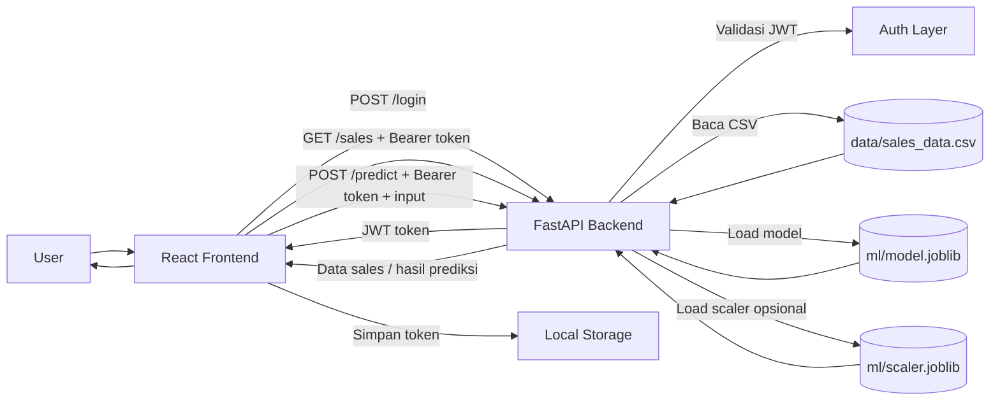
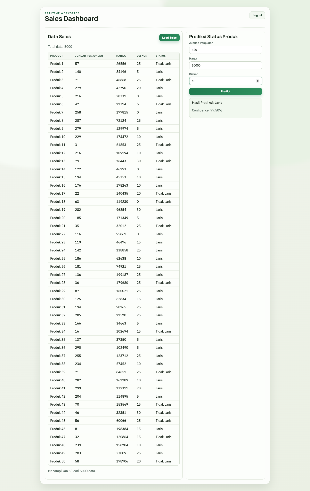

# Mini App E2E: React + FastAPI + ML

## 1) System Design (Ringkas)



### Alur Data
Alur dimulai dari React saat user melakukan login. Frontend memanggil endpoint `POST /login` ke FastAPI dengan kredensial user. Backend memvalidasi kredensial, lalu membuat JWT token yang dikirim kembali ke frontend. Token ini disimpan di sisi client (misalnya `localStorage`) dan dipakai ulang untuk request berikutnya melalui header `Authorization: Bearer <token>`.

Saat user membuka dashboard, React memanggil `GET /sales` dengan Bearer token. Di backend, middleware/dependency auth memverifikasi token terlebih dahulu. Jika valid, backend membaca data dari `data/sales_data.csv`, melakukan parsing/transformasi ringan jika diperlukan, lalu mengirim data terstruktur ke frontend untuk ditampilkan sebagai tabel atau ringkasan metrik.

Untuk fitur prediksi, React mengirim input user ke `POST /predict` (tetap dengan Bearer token). Setelah token valid, backend memuat model terlatih dari `ml/model.joblib` dan memuat `ml/scaler.joblib` bila pipeline training memakai normalisasi fitur. Input diproses dengan langkah preprocessing yang sama seperti saat training, lalu model menghasilkan nilai prediksi. Hasil prediksi dikembalikan ke React sebagai JSON dan ditampilkan di dashboard.

Dari sisi ML, proses training berjalan terpisah dari request runtime: script training membaca `data/sales_data.csv`, melatih model, kemudian menyimpan artifact (`model.joblib` dan opsional `scaler.joblib`) ke folder `ml/`. Backend hanya melakukan load artifact saat inferensi, sehingga response lebih cepat dan arsitektur tetap sederhana untuk target pengerjaan 1 hari.

## 2) Machine Learning

- Script training: `ml/train.py`
- Model: `RandomForestClassifier` (tanpa scaling)
- Features: `jumlah_penjualan`, `harga`, `diskon`
- Label: `status` (`Laris=1`, `Tidak=0`)
- Output artifact: `ml/model.joblib`

Contoh jalankan training:

```bash
.venv/bin/python ml/train.py
```

Log hasil training (2026-03-05):

```text
Training selesai.
Data train: 4000 rows
Data test : 1000 rows
Accuracy  : 1.0000
Model disimpan di: /Users/macbookair/Downloads/FullstackTechnicalTest-GoodevaTechnology /ml/model.joblib
```

## 3) Backend FastAPI

Struktur backend:

```text
backend/
├─ main.py
├─ schemas.py
├─ core/
│  └─ security.py
├─ routers/
│  ├─ auth.py
│  ├─ sales.py
│  └─ predict.py
└─ services/
   ├─ sales_service.py
   └─ ml_service.py
```

Endpoint:
- `POST /login` -> return JWT token (dummy user via env `APP_USERNAME` / `APP_PASSWORD`, default `admin/admin123`)
- `GET /sales` -> return list data dari `data/sales_data.csv` (wajib Bearer token)
- `POST /predict` -> input `jumlah_penjualan`, `harga`, `diskon`; output `status_prediksi` + optional `probability` (wajib Bearer token)

Menjalankan backend:

```bash
.venv/bin/python -m pip install -r backend/requirements.txt
.venv/bin/python -m uvicorn backend.main:app --reload
```

Swagger otomatis tersedia di:
- `http://127.0.0.1:8000/docs`

## 4) Frontend React

Struktur frontend:

```text
frontend/
├─ index.html
├─ package.json
├─ vite.config.js
└─ src/
   ├─ App.jsx
   ├─ main.jsx
   ├─ styles.css
   └─ pages/
      ├─ LoginPage.jsx
      └─ DashboardPage.jsx
```

Fitur:
- Login page:
  - Form `username/password`
  - Call `POST /login`
  - Simpan JWT ke `localStorage` (`access_token`)
- Dashboard page:
  - Tombol `Load Sales` -> call `GET /sales`
  - Tabel data sales
  - Form prediksi (`jumlah_penjualan`, `harga`, `diskon`) -> call `POST /predict`
  - Tampil hasil `Laris / Tidak Laris`

Menjalankan frontend:

```bash
cd frontend
npm install
npm run dev
```

Default API base URL:
- `http://127.0.0.1:8000` (bisa diubah via `frontend/.env.example`)

Screenshot dashboard:
- `frontend/dashboard-screenshot.png`

### Preview Test (Dashboard)

Screenshot berikut diambil setelah skenario end-to-end di dashboard:
- Login dengan `admin / admin123`
- Klik `Load Sales` sampai tabel terisi
- Input prediksi:
  - `jumlah_penjualan = 120`
  - `harga = 80000`
  - `diskon = 10`
- Klik `Predict` dan tampil hasil status prediksi



## 5) Run Guide + Catatan Implementasi

### Prasyarat
- Python 3.11+ (atau versi yang mendukung dependency pada `backend/requirements.txt`)
- Node.js 18+
- npm

### Cara Menjalankan ML Training

```bash
# dari project root
python3 -m venv .venv
.venv/bin/python -m pip install -r backend/requirements.txt
.venv/bin/python -m pip install pandas scikit-learn
.venv/bin/python ml/train.py
```

Hasil training akan membuat:
- `ml/model.joblib`

### Cara Menjalankan Backend

```bash
# dari project root
.venv/bin/python -m uvicorn backend.main:app --reload
```

Backend aktif di:
- `http://127.0.0.1:8000`
- Swagger: `http://127.0.0.1:8000/docs`

Optional environment variable:
- `APP_USERNAME` (default: `admin`)
- `APP_PASSWORD` (default: `admin123`)
- `JWT_SECRET_KEY` (default hardcoded untuk dev)
- `JWT_EXPIRE_MINUTES` (default: `60`)

### Cara Menjalankan Frontend

```bash
cd frontend
npm install
npm run dev
```

Frontend aktif di:
- `http://127.0.0.1:5173`

Konfigurasi API frontend:
- Salin `frontend/.env.example` menjadi `.env` jika ingin override base URL
- `VITE_API_BASE_URL=http://127.0.0.1:8000`

### Design Decision (Singkat)
- Model `RandomForestClassifier` dipilih agar cepat jadi, robust untuk data tabular, dan tidak wajib scaling.
- Auth memakai dummy username/password untuk mempercepat delivery technical test; fokus ke flow JWT end-to-end.
- Dataset dibaca dari CSV (`data/sales_data.csv`) agar implementasi sederhana tanpa database.
- Model training dipisah dari runtime API; backend hanya load artifact (`ml/model.joblib`) saat inferensi.

### Asumsi
- Label mapping: `status = Laris -> 1`, `Tidak -> 0`.
- Input `diskon` diasumsikan angka persen langsung (contoh `25` berarti `25%`, bukan `0.25`).
- Kolom CSV wajib ada: `jumlah_penjualan`, `harga`, `diskon`, `status`.
- `POST /predict` mengembalikan kelas bisnis:
  - `Laris`
  - `Tidak` (ditampilkan sebagai `Tidak Laris` di frontend)

### Opsi Docker (Opsional)
- Belum dibuat di versi ini agar fokus pada kelengkapan fitur inti 1 hari.
- Jika dibutuhkan, next step adalah menambah:
  - `Dockerfile` backend
  - `Dockerfile` frontend
  - `docker-compose.yml` untuk menjalankan keduanya sekaligus
